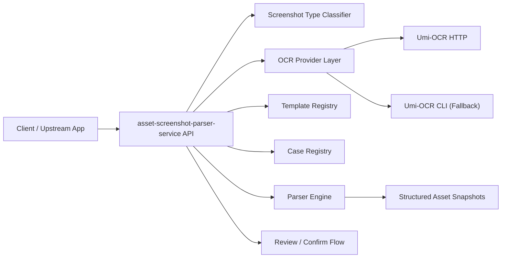

# Asset Screenshot Parser Service Design

Last updated: 2026-05-11

## Goal

Build a new standalone service for:

- personal asset management
- family asset management
- investment screenshot parsing
- screenshot template and case management

This service should be reusable by `daily_stock_analysis` and future projects.

## Executive Decision

Do **not** create a separate custom `shared-ocr-service` repository right now.

Instead:

- create one new project: `asset-screenshot-parser-service`
- integrate OCR inside this new service through a provider abstraction
- use **Umi-OCR** as the default OCR engine provider
- keep the door open for future providers such as PaddleX, cloud OCR, or custom engines

Reason:

- the current need is only a simple OCR capability
- Umi-OCR already provides HTTP and CLI invocation modes
- maintaining a separate OCR infrastructure repo adds cost without adding enough near-term value
- the real long-term asset is not OCR itself, but screenshot templates, cases, parsing rules, and structured asset snapshots

## Decision Summary

### Chosen Architecture

One standalone service:

- `asset-screenshot-parser-service`

Inside that service:

- OCR provider layer
- screenshot type classifier
- template registry
- case registry
- parser engine
- human review / confirmation flow
- snapshot storage

OCR is an internal dependency, not a separately released product.

### Rejected Architecture

Two repositories:

- `shared-ocr-service`
- `asset-screenshot-parser-service`

Rejected for now because:

- too much operational overhead for the current scope
- duplicate deployment and monitoring work
- the user only needs a simple OCR function
- Umi-OCR already covers the OCR engine layer well enough

## Functional Scope

### In Scope

- upload screenshot
- classify screenshot type
- call OCR provider
- apply template-based parsing
- return structured asset snapshot
- manage templates
- manage screenshot cases
- support manual correction and confirmation
- support multiple asset screenshot families over time

### Out of Scope

- custom OCR model training
- independent OCR product positioning
- billing / multi-tenant OCR platform
- direct broker login automation
- direct Tonghuashun / Alipay account crawling

## High-Level Architecture



## Service Boundary

### `asset-screenshot-parser-service` Owns

- OCR provider abstraction
- Umi-OCR HTTP / CLI integration
- screenshot type classification
- template definitions
- template versioning
- screenshot case fixtures
- parser rules
- parsing evaluation
- structured snapshot storage
- review / confirm state
- export API for downstream consumers

### Upstream Consumer Owns

Examples:

- `daily_stock_analysis`
- future household asset dashboards
- future investment management tools

These consumers should own:

- alerting and notifications
- Feishu doc synchronization
- portfolio analytics
- risk modeling
- investment research workflows

They should consume structured snapshots from the parser service, not raw OCR output.

## OCR Strategy

### Default Provider

Use **Umi-OCR** first.

Preferred call order:

1. `Umi-OCR HTTP`
2. `Umi-OCR CLI`
3. future provider fallback if needed

### Why Umi-OCR

- offline
- supports HTTP API
- supports CLI invocation
- supports Linux runtime and Docker deployment
- no need to maintain our own PaddleX serving product for this stage

### Operational Trade-off

Umi-OCR is simpler and cheaper than maintaining a custom OCR platform, but:

- Linux runtime still has environment constraints
- CPU compatibility matters
- response format is product-defined, so the provider layer must normalize it

## Screenshot Type Model

Initial supported types:

- `ths_stock_positions_mobile_v1`
- `alipay_fund_positions_mobile_v1`

Future examples:

- `broker_stock_positions_mobile_v1`
- `bank_wealth_positions_mobile_v1`
- `insurance_policy_assets_mobile_v1`
- `crypto_exchange_assets_mobile_v1`

Each screenshot type maps to one parser family plus one or more layout templates.

## Template System

### Template Entity

Suggested fields:

- `template_id`
- `template_type`
- `platform`
- `client_family`
- `layout_version`
- `asset_domain`
- `active`
- `field_schema`
- `parser_rules`
- `normalization_rules`
- `example_case_ids`
- `created_at`
- `updated_at`

### Notes

- `template_type` example: `ths_stock_positions`
- `platform` example: `ths`, `alipay`
- `client_family` example: `ios`, `android`, `generic`
- `layout_version` is mandatory because screenshot UI changes over time

## Case System

### Case Entity

Suggested fields:

- `case_id`
- `template_type`
- `template_version`
- `source_platform`
- `image_uri`
- `ocr_raw_payload`
- `expected_snapshot`
- `actual_snapshot`
- `status`
- `review_notes`
- `created_at`
- `updated_at`

### Case Status

- `draft`
- `verified`
- `failed`
- `deprecated`

### Why Cases Matter

The case library is the long-term moat.

It allows:

- regression testing
- parser evolution
- template version comparisons
- controlled rollout when app layouts change

## API Design

Base prefix:

- `/api/v1`

### 1. Parse Screenshot

`POST /api/v1/screenshots/parse`

Purpose:

- upload screenshot
- optionally pass a screenshot type hint
- return OCR + classification + parsed snapshot candidate

Request:

```json
{
  "source_platform": "ths|alipay|unknown",
  "screenshot_type_hint": "ths_stock_positions_mobile_v1",
  "image_base64": "<base64>",
  "filename": "holdings.jpg",
  "review_mode": true
}
```

Response:

```json
{
  "request_id": "req_123",
  "ocr_provider": "umi_http",
  "screenshot_type": "ths_stock_positions_mobile_v1",
  "template_id": "ths_stock_positions_ios_v1",
  "template_version": "1.0.0",
  "classification_confidence": 0.96,
  "warnings": [],
  "ocr": {
    "full_text": "同花顺App ...",
    "line_count": 82
  },
  "snapshot_candidate": {
    "summary": {
      "total_assets": 44380.87,
      "total_market_value": 34049.00,
      "daily_pnl": -69.00
    },
    "positions": [
      {
        "name": "航天发展",
        "symbol": "000547",
        "asset_type": "stock",
        "quantity": 300,
        "market_value": 8376.00,
        "cost_price": 39.017,
        "last_price": 27.920,
        "pnl_amount": -3338.19,
        "pnl_pct": -28.44,
        "confidence": "medium"
      }
    ]
  }
}
```

### 2. Confirm Parsed Snapshot

`POST /api/v1/screenshots/confirm`

Purpose:

- accept reviewed structured data
- persist final snapshot

Request:

```json
{
  "request_id": "req_123",
  "template_id": "ths_stock_positions_ios_v1",
  "template_version": "1.0.0",
  "confirmed_snapshot": {
    "summary": {
      "total_assets": 44380.87
    },
    "positions": []
  }
}
```

Response:

```json
{
  "snapshot_id": "snap_123",
  "status": "confirmed"
}
```

### 3. Get Latest Snapshot

`GET /api/v1/snapshots/latest?household_id=default&asset_domain=investment`

Response:

```json
{
  "snapshot_id": "snap_123",
  "captured_at": "2026-05-11T14:00:00+08:00",
  "positions": []
}
```

### 4. List Templates

`GET /api/v1/templates`

Filters:

- `template_type`
- `platform`
- `active`

### 5. Create Template

`POST /api/v1/templates`

### 6. Update Template

`PATCH /api/v1/templates/{template_id}`

### 7. Activate Template Version

`POST /api/v1/templates/{template_id}/activate`

### 8. List Cases

`GET /api/v1/cases`

### 9. Create Case

`POST /api/v1/cases`

Purpose:

- upload example screenshot
- store expected output
- register a regression case

### 10. Evaluate Cases

`POST /api/v1/cases/evaluate`

Purpose:

- batch-run parser against registered cases
- produce pass / fail summary

### 11. Health

`GET /api/v1/health`

### 12. OCR Provider Health

`GET /api/v1/ocr/health`

Response should report:

- current provider
- HTTP availability
- CLI fallback availability
- timeout configuration

## Internal Provider Interface

The new service should not depend directly on one OCR product everywhere.

Define an internal provider contract:

```python
class OCRProvider(Protocol):
    def recognize(
        self,
        *,
        image_bytes: bytes,
        mime_type: str,
        scene_hint: str | None = None,
    ) -> OCRPayload: ...
```

Initial implementations:

- `UmiHttpProvider`
- `UmiCliProvider`

Later possible providers:

- `PaddlexGatewayProvider`
- `CloudOcrProvider`

## Suggested Repository Structure

```text
asset-screenshot-parser-service/
├─ app/
│  ├─ api/
│  │  ├─ routes/
│  │  └─ schemas/
│  ├─ core/
│  ├─ providers/
│  │  └─ ocr/
│  │     ├─ base.py
│  │     ├─ umi_http.py
│  │     └─ umi_cli.py
│  ├─ parsers/
│  │  ├─ base.py
│  │  ├─ ths_stock_positions.py
│  │  └─ alipay_fund_positions.py
│  ├─ templates/
│  ├─ cases/
│  ├─ services/
│  ├─ repositories/
│  ├─ models/
│  └─ support/
├─ tests/
│  ├─ fixtures/
│  │  ├─ screenshots/
│  │  ├─ ocr_payloads/
│  │  └─ expected/
│  └─ integration/
├─ docker/
│  ├─ compose.yml
│  └─ umi-ocr/
├─ scripts/
├─ docs/
└─ .github/workflows/
```

## Migration Inventory

### Move Now

These files contain the core of the new service and should move into the new repo.

| Current file | New service target | Action |
| --- | --- | --- |
| [src/services/holding_ocr_parser.py](/Users/Reuxs/workspace/creative/daily_stock_analysis/src/services/holding_ocr_parser.py) | `app/parsers/` | Move and split by screenshot family |
| [src/services/holding_image_extractor.py](/Users/Reuxs/workspace/creative/daily_stock_analysis/src/services/holding_image_extractor.py) | `app/services/` | Move, then remove `daily_stock_analysis`-specific fallback paths |
| [src/repositories/external_holdings_repo.py](/Users/Reuxs/workspace/creative/daily_stock_analysis/src/repositories/external_holdings_repo.py) | `app/repositories/` | Move as snapshot persistence layer |
| [src/services/external_holdings_service.py](/Users/Reuxs/workspace/creative/daily_stock_analysis/src/services/external_holdings_service.py) | `app/services/` | Move and rename around snapshot orchestration |
| [src/services/holdings_reminder_service.py](/Users/Reuxs/workspace/creative/daily_stock_analysis/src/services/holdings_reminder_service.py) | `app/services/` | Move if the new service should own screenshot reminders |
| [api/v1/endpoints/external_holdings.py](/Users/Reuxs/workspace/creative/daily_stock_analysis/api/v1/endpoints/external_holdings.py) | `app/api/routes/` | Move and redesign route shapes |
| [api/v1/schemas/external_holdings.py](/Users/Reuxs/workspace/creative/daily_stock_analysis/api/v1/schemas/external_holdings.py) | `app/api/schemas/` | Move and normalize DTOs |
| [tests/test_external_holdings_api.py](/Users/Reuxs/workspace/creative/daily_stock_analysis/tests/test_external_holdings_api.py) | `tests/integration/` | Move and re-scope |
| [tests/test_holding_image_extractor.py](/Users/Reuxs/workspace/creative/daily_stock_analysis/tests/test_holding_image_extractor.py) | `tests/` | Move |
| [tests/test_holding_ocr_parser.py](/Users/Reuxs/workspace/creative/daily_stock_analysis/tests/test_holding_ocr_parser.py) | `tests/` | Move |
| [tests/test_holdings_reminder_service.py](/Users/Reuxs/workspace/creative/daily_stock_analysis/tests/test_holdings_reminder_service.py) | `tests/` | Move |

### Extract, Then Move

These files should not move as-is. Only extract the reusable part.

| Current file | Keep / extract rule |
| --- | --- |
| [src/data/stock_index_loader.py](/Users/Reuxs/workspace/creative/daily_stock_analysis/src/data/stock_index_loader.py) | Extract only exact-name-to-code lookup support into a dedicated security-master helper |
| [src/services/name_to_code_resolver.py](/Users/Reuxs/workspace/creative/daily_stock_analysis/src/services/name_to_code_resolver.py) | Reuse only the name resolution part needed by asset parsers |
| [src/services/stock_code_utils.py](/Users/Reuxs/workspace/creative/daily_stock_analysis/src/services/stock_code_utils.py) | Extract normalization helpers only |
| [src/storage.py](/Users/Reuxs/workspace/creative/daily_stock_analysis/src/storage.py) | Copy only external-holdings-related models into a clean new model module |
| [src/config.py](/Users/Reuxs/workspace/creative/daily_stock_analysis/src/config.py) | Recreate only parser-service-specific config, do not fork whole config system |
| [src/core/config_registry.py](/Users/Reuxs/workspace/creative/daily_stock_analysis/src/core/config_registry.py) | Recreate only if the new service also needs a UI-managed config registry |

### Do Not Move To The New Service

These belong to consuming apps or to the abandoned custom OCR direction.

| Current file | Reason |
| --- | --- |
| [docker/ocr-service/](/Users/Reuxs/workspace/creative/daily_stock_analysis/docker/ocr-service) | Keep only as temporary reference; new service should prefer Umi-OCR provider integration |
| [src/services/ocr_service_client.py](/Users/Reuxs/workspace/creative/daily_stock_analysis/src/services/ocr_service_client.py) | Specific to the temporary custom OCR gateway; replace with `UmiHttpProvider` / `UmiCliProvider` |
| [src/services/external_holdings_doc_service.py](/Users/Reuxs/workspace/creative/daily_stock_analysis/src/services/external_holdings_doc_service.py) | Feishu doc sync is consumer-facing integration, not core parser logic |
| [apps/dsa-web/src/components/portfolio/](/Users/Reuxs/workspace/creative/daily_stock_analysis/apps/dsa-web/src/components/portfolio/) | Current web UI is attached to `daily_stock_analysis`; do not drag it into the new service by default |
| [apps/dsa-web/src/api/externalHoldings.ts](/Users/Reuxs/workspace/creative/daily_stock_analysis/apps/dsa-web/src/api/externalHoldings.ts) | Consumer-side integration only |

## What Stays In `daily_stock_analysis`

After migration, this repo should only keep:

- one small client adapter for the new service
- consumer-facing settings
- downstream snapshot consumption
- Feishu / email / report integration

It should stop owning:

- screenshot template registry
- screenshot case registry
- OCR orchestration
- screenshot parsing rules

## CI/CD Recommendation

Reuse the AnyKnews production discipline almost directly.

### Keep These Rules

- deploy production from `main` or immutable tags only
- keep Tencent Cloud as runtime target, not development workspace
- use a guarded deploy script
- require local verification plus CI verification before release
- use project-scoped restarts only

Reference files already proven in the other project:

- [docs/codex-workspace-cicd-standard.md](/Users/Reuxs/workspace/creative/daily_news_platform/docs/codex-workspace-cicd-standard.md)
- [scripts/deploy-production.sh](/Users/Reuxs/workspace/creative/daily_news_platform/scripts/deploy-production.sh)
- [docs/tencent-cloud-deploy.md](/Users/Reuxs/workspace/creative/daily_news_platform/docs/tencent-cloud-deploy.md)

### Recommended New Service Release Shape

- repo default branch: `main`
- production path: `main` or release tag only
- server path: `/opt/asset-screenshot-parser-service`
- service name: `parser-service`
- optional colocated service name: `umi-ocr`

### Minimum Local Checks

For the new service:

```bash
python -m pytest
python -m py_compile <changed_python_files>
docker compose config
docker compose build parser-service
```

### Suggested Deploy Script

The new repo should contain:

- `scripts/guard-production-release.sh`
- `scripts/deploy-production.sh`

Modeled after AnyKnews, but scoped to:

- `parser-service`
- optional `umi-ocr`
- parser health endpoint

## Tencent Cloud Availability Check

### Verified In This Turn

Public health endpoint:

- `http://101.32.251.91:3000/api/health`

Observed result on 2026-05-11:

- HTTP endpoint reachable
- returned `status: ok`
- indicates the Tencent Cloud host and at least one deployed app are currently alive

### Not Verified In This Turn

- direct SSH login
- server shell access
- current Docker/container state on the server
- available disk / CPU / memory on the host
- whether that same machine is the right place for the new parser service

So the server is **publicly reachable**, but **operationally only partially verified**.

## Final Recommendation

### Build Next

Create:

- `asset-screenshot-parser-service`

Inside it:

- OCR provider abstraction
- Umi-OCR provider
- template registry
- case registry
- parser engine
- snapshot storage

### Do Not Build Yet

- separate custom `shared-ocr-service` product repo

### Consumer Integration Strategy

`daily_stock_analysis` should later call the new service through a narrow API adapter and only consume confirmed structured asset snapshots.
